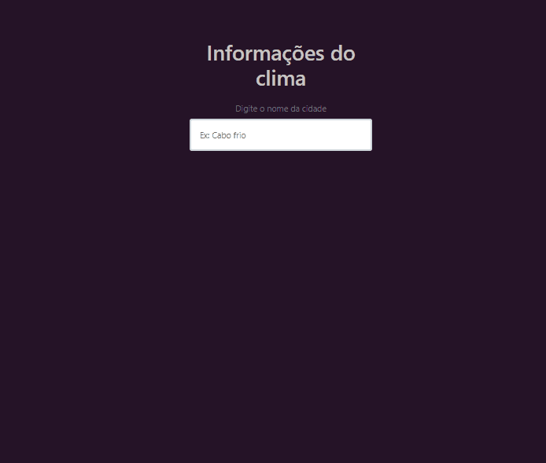

<h1 align='center'>Weather Application 🌥️ </h1>

A Weather Application é uma aplicação feita em JavaScript puro, com o uso da AccuWeather Api ([AccuWeather Api](https://developer.accuweather.com/)) para obter os dados do clima de uma cidade pesquisada :earth_americas:

 

➡️ Teste a aplicação <a href="https://weatherapp-013.netlify.app/" target="_blank">Clique Aqui!</a>
 
---

#### Feito por Nathan Moreira 🦊 🐸 🍜

